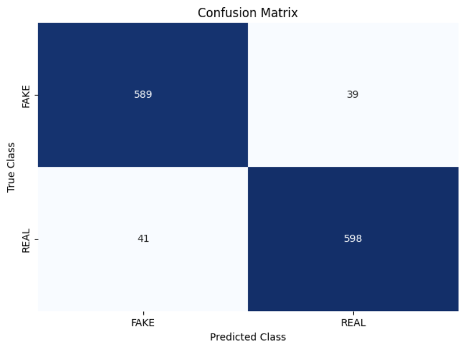

# Fake News Detector
An application of ML to detect fake news

## How To Run it

### 1. Input the news data
- Download sample news data from "https://drive.google.com/file/d/1er9NJTLUA3qnRuyhfzuN0XUsoIC4a-_q/view"
- Save the news data in a file named 'news.csv' in the active directory

### 2. Run the prediction model
- Run all of the Jupyter Lab cells in 'fake_news_detector.ipynb'

### 3. Evaluate the model's performance
- Determine whether the returned Recall and F1 scores are adequate to rely on the model

